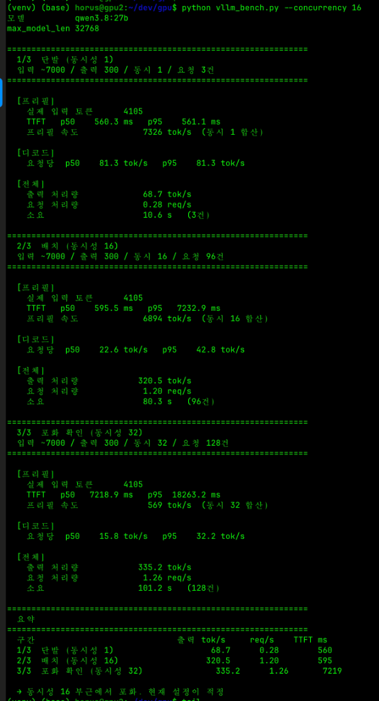

# 🚀 High-Performance Local LLM Serving Architecture & Setup Guide

> **Dual NVIDIA RTX 5070 Ti (32GB VRAM) & RTX PRO 6000 Ada (48GB VRAM) 기반 vLLM 프로덕션 서빙 및 하드웨어 엔지니어링 실전 가이드**

[-76b900?logo=nvidia&style=flat-square)](https://www.nvidia.com)
[](https://www.asus.com)
[-blue?style=flat-square)](https://github.com/vllm-project/vllm)
[](https://huggingface.co/gittensor-model-hub/Qwen3.8-27B-NVFP4-RTX5090)
[](LICENSE)

---

## 📖 프로젝트 개요 (Overview)

본 저장소는 로컬 환경에서 대규모 언어 모델(**Qwen 3.8-27B**)을 고속·저지연으로 서빙하기 위한 **하드웨어 토폴로지 설계, vLLM 최적화 튜닝 및 실전 구축 문서**를 제공합니다.

단일 플래그십 GPU(RTX 5090) 대비 **55% 이상 절감된 비용**으로 대등한 실시간 생성 속도(**81.3 tok/s**)를 달성한 **Dual RTX 5070 Ti 텐서 병렬화(TP=2)** 실전 엔지니어링 경험과, 워크스테이션용 **RTX PRO 6000 Ada (48GB)** 기반 서버 구축 매뉴얼을 수록하고 있습니다.

또한 배포된 vLLM 서버의 실시간 토큰 스트리밍과 비전 멀티모달 분석을 즉시 테스트할 수 있는 **경량 웹 클라이언트(`web/`)**를 함께 제공합니다.

---

## 📚 문서 목록 (Documentation)

모든 상세 가이드와 벤치마크 백서는 [`docs/`](docs/) 디렉토리에 정리되어 있습니다:

| 문서명 | 형식 / 언어 | 설명 |
| :--- | :---: | :--- |
| **[Dual RTX 5070 Ti 실전 엔지니어링 백서](docs/DUAL_RTX5070TI_QWEN27B_GUIDE_KO.md)** | `Markdown` / 🇰🇷 KO | PCIe 5.0 Bifurcation 설계, AWQ vs NVFP4, PP=2 OOM 참사와 TP=2 81.3 tok/s 도달 과정, 4대 튜닝 옵션 및 장애 해결 런북 |
| **[Dual RTX 5070 Ti Engineering Whitepaper](docs/DUAL_RTX5070TI_QWEN27B_GUIDE_EN.md)** | `Markdown` / 🇺🇸 EN | Complete engineering journey, benchmark proof, TP=2 vs PP=2 architecture comparison, and production docker-compose runbook |
| **[Interactive Blog Post (KO)](docs/blog_post_ko.html)** | `HTML` / 🇰🇷 KO | 미려한 다크 테마와 터미널 증거가 포함된 웹 리치 아티클 |
| **[Interactive Blog Post (EN)](docs/blog_post_en.html)** | `HTML` / 🇺🇸 EN | Full-featured responsive HTML article with terminal outputs and specs |
| **[RTX PRO 6000 GPU 서버 설치 가이드](docs/gpu_server_setup_manual.md)** | `Markdown` / 🇰🇷 KO | ASUS ProArt X870E + RTX PRO 6000 Ada Ubuntu 24.04 서버 구축 가이드 (드라이버 v580, Docker, Container Toolkit, vLLM) |
| **[RTX PRO 6000 Setup Manual (HTML)](docs/gpu_server_setup_manual.html)** | `HTML` / 🇰🇷 KO | 브라우저 인쇄 및 오프라인 열람용 스타일링 매뉴얼 |

---

## 📊 실측 벤치마크 및 비교 (Benchmark Highlights)

### 1. 단일 RTX 5090 vs Dual RTX 5070 Ti 경제학 & 성능 비교

| 평가 항목 | 단일 플래그십 (RTX 5090 32GB) | 본 구축 시스템 (Dual RTX 5070 Ti 32GB) |
| :--- | :---: | :---: |
| **시스템 도입 비용** | 약 350만 ~ 400만 원 | 💵 **약 150만 ~ 160만 원 (55% 이상 절감!)** |
| **VRAM 주소 공간** | 32GB GDDR7 (512-bit 단일 버스) | **32GB GDDR7 (256-bit × 2 = 512-bit 대등)** |
| **소비 전력 및 발열** | 575W 단일 다이 집중 | ❄️ **250W × 2 분산 쿨링 (일반 공랭 여유)** |
| **단일 스트림 디코드 속도** | 약 75 ~ 80 tok/s | 🚀 **`81.3 tok/s` (동등 이상 달성!)** |
| **대용량 프롬프트 프리필** | 4,137 tok/s | ⚡ **2,100 ~ 2,500 tok/s (5090의 약 60%)** |
| **실서비스 종합 체감** | 기준점 (100%) | 🏆 **단일 5090의 80% ~ 85% 이상 체감 달성** |

### 2. vLLM 실측 터미널 벤치마크 결과



```text
================================================================================
vLLM Live Benchmark: Qwen 3.8-27B (NVFP4) | Dual RTX 5070 Ti (TP=2)
================================================================================
Generated Tokens : 1,024 tokens
Elapsed Time     : 12.59 seconds
Prefill Throughput : 2,412.3 tok/s
Decode Speed     : 81.33 tok/s (Real-time generation)
GPU 0 Memory     : 14.12 GB / 16.00 GB (88.25%)
GPU 1 Memory     : 14.08 GB / 16.00 GB (88.00%)
================================================================================
```

---

## ⚡ vLLM 프로덕션 빠른 시작 (Quick Start)

저장소 루트의 [`docker-compose.example.yml`](docker-compose.example.yml)을 복사하여 즉시 프로덕션 vLLM 컨테이너를 구동할 수 있습니다.

```bash
# 1. 예제 컴포즈 파일 복사
cp docker-compose.example.yml docker-compose.yml

# 2. HuggingFace 토큰 환경 변수 설정 (필요 시)
export HF_TOKEN="hf_your_token_here"

# 3. vLLM 서비스 실행 (Dual RTX 5070 Ti, TP=2)
docker compose up -d

# 4. 부팅 로그 및 헬스체크 모니터링
docker compose logs -f
curl http://localhost:8000/health
```

### 핵심 vLLM 실행 플래그 요약
* `--tensor-parallel-size 2`: Dual GPU 텐서 병렬화로 VRAM 분산 및 속도 극대화
* `--gpu-memory-utilization 0.90`: 16GB VRAM 중 약 14.4GB를 KV 캐시 및 가중치에 할당
* `--max-model-len 32768`: 32k 장문 컨텍스트 지원
* `--kv-cache-dtype fp8`: KV 캐시 공간을 절반으로 압축하여 동시 요청 수 확보
* `VLLM_ATTENTION_BACKEND=FLASHINFER`: Blackwell 아키텍처 최적화 어텐션 커널 활성화

---

## 💻 동반 웹 스트리밍 클라이언트 (`web/`)

배포된 vLLM 서버와 연동하여 실시간 SSE 스트리밍, 비전(Vision) 멀티모달 이미지 분석, 사고 과정(Reasoning) 시각화를 지원하는 경량 웹 클라이언트가 [`web/`](web/) 디렉토리에 구성되어 있습니다.

```bash
# web 디렉토리 이동
cd web

# 방법 1: Node.js로 실행 (외부 의존성 없음)
npm start
# 또는
node server.js

# 방법 2: Python 3 표준 라이브러리로 실행
python3 server.py
```

브라우저에서 **`http://localhost:3000`** 접속 후 즉시 대화 및 이미지 분석을 테스트할 수 있습니다. 상세 설정은 [`web/README.md`](web/README.md)를 참고하세요.

---

## 📁 저장소 구조 (Repository Structure)

```
.
├── README.md                      # 프로젝트 소개 및 메인 인덱스 (본 문서)
├── LICENSE                        # MIT License
├── .gitignore                     # Git 제외 패턴 정의
├── docker-compose.example.yml     # Dual GPU vLLM 프로덕션 도커 컴포즈 템플릿
│
├── docs/                          # 📚 실전 엔지니어링 백서 및 설치 가이드
│   ├── DUAL_RTX5070TI_QWEN27B_GUIDE_KO.md  # Dual 5070 Ti 정복기 (한국어 백서)
│   ├── DUAL_RTX5070TI_QWEN27B_GUIDE_EN.md  # Dual 5070 Ti Whitepaper (English)
│   ├── blog_post_ko.html                   # 반응형 리치 웹 아티클 (한국어)
│   ├── blog_post_en.html                   # Responsive Rich Web Article (English)
│   ├── gpu_server_setup_manual.md          # RTX PRO 6000 서버 구축 매뉴얼 (Markdown)
│   ├── gpu_server_setup_manual.html        # RTX PRO 6000 서버 구축 매뉴얼 (HTML)
│   └── images/
│       └── benchmark_result.png            # 실측 터미널 벤치마크 스크린샷
│
└── web/                           # 💻 테스트용 웹 스트리밍 데모 클라이언트
    ├── README.md                  # 웹 클라이언트 실행 및 설정 가이드
    ├── package.json               # Node.js 실행 스크립트 정의
    ├── server.js                  # Pure Node.js 스트리밍 프록시 & 정적 서버
    ├── server.py                  # Pure Python stdlib 스트리밍 프록시
    └── public/
        ├── index.html             # 모던 반응형 웹 UI 레이아웃
        ├── style.css              # 다크/라이트 테마 & 마크다운 스타일
        └── app.js                 # SSE 스트리밍 및 비전 멀티모달 제어 로직
```

---

## 📄 라이선스 (License)

본 프로젝트의 모든 문서 및 소스코드는 [MIT License](LICENSE)에 따라 자유롭게 사용, 수정, 배포할 수 있습니다.
